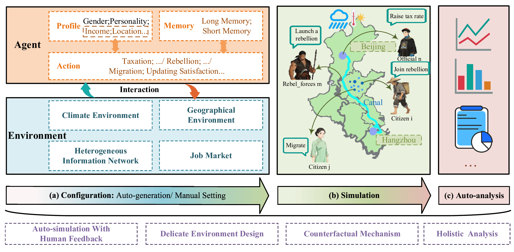

# Eco3S

**语言选择:** [English](README.md) | [中文](README_zh.md)

---

## 简介



**Eco3S** (Complex **Eco**nomic **S**ocial **S**ystem **S**imulation) 是一个专为经济研究与政策分析设计的多智能体模拟框架。它利用大语言模型（LLMs）赋予智能体复杂的感知、推理和决策能力，填补了传统模拟方法在环境交互、反事实推断及场景泛化方面的空白。Eco3S 包含三个核心模块：精细化智能体/环境配置、高保真模拟以及自动化多维分析。

### 核心亮点
1.  **精细化环境设计 (Delicate Environment Design)**：模拟动态演变的物理环境（气候、地理）、异构信息网络（HIN）及"个体-群体"双决策模式。
2.  **反事实实验机制 (Counterfactual Mechanism)**：支持在任意模拟步骤保存快照、回滚并修改干预条件（政策、环境参数），实现严谨的因果效应评估。
3.  **人类反馈驱动的自动模拟 (Auto-Simulation)**：通过 AI Agent 委员会（架构师、程序员、分析师）将自然语言需求自动转化为实验场景。
4.  **全自动多维分析 (Auto-Analysis)**：自动解析模拟轨迹，生成统计图表、因果解释报告。

## 快速开始

### API 配置说明

如果要使用大模型进行模拟，必须先配置各 API 的地址和密钥；可用模型列表与默认选择则是可选修改项。

相关配置主要集中在：
- [config/api_models_config.yaml]：配置可用模型、`model_platform`、`rate_limit_key` 和各 API 的参数。
- [.env]：配置各 API 对应的地址和密钥，例如 `OPENAI_API_BASE_URL`、`OPENAI_API_KEY`

一般情况下，只需要先在 `.env` 里填好地址和密钥，再在 `config/api_models_config.yaml` 里启用或切换模型即可。

### 环境配置

```bash
# 创建虚拟环境
conda create --name Eco3S python=3.10
conda activate Eco3S

# 安装依赖
pip install -r requirements.txt
```

### 启动可视化界面

**方式一：Windows 用户一键启动**
```bash
start_web.bat
```

**方式二：手动启动**
1. 启动后端服务
```bash
cd src
python app.py
```

2. 启动前端服务（新终端）
```bash
cd frontend
npm install  # 首次运行需要
npm install chart.js vue-chartjs  # 首次运行需要
npm run dev
```

访问 http://localhost:5173 查看 Web 界面。

---

## 使用方式

### 一、传统模拟模式

Eco3S 内置了多个基于顶级经济学/历史学研究复现的基准场景：
1.  **运河衰败与叛乱 (Canal Decay and Rebellion)**：复现 Cao & Chen (2022) 的研究，探讨交通基础设施（京杭大运河）演变对社会稳定性的影响。
2.  **治理的起源 (Origins of Governance/TEOG)**：基于 Allen (2023) 的发现，模拟由于气候/河流变化产生的集体行动和政府雏形。
3.  **信息传播与政策实施 (Information Propagation)**：复现 Banerjee et al. (2016) 关于印度废钞政策的研究，测试不同传播策略（种子节点 vs 广播）的效果。

#### 可用场景

**1. 运河的衰败**
```bash
python entrypoints/main.py --config_path config/default/simulation_config.yaml
```

**2. TEOG 场景**
```bash
python entrypoints/main_TEOG.py --config_path config/TEOG/simulation_config.yaml
```

**3. 信息传播**
```bash
python entrypoints/main_info_propagation.py --config_path config/info_propagation/simulation_config.yaml
```

### 二、AI 辅助模拟模式

通过自然语言描述需求，系统自动完成实验设计、代码生成、运行模拟和结果优化的全流程。

#### 启动系统

```bash
python run_ai_system.py
```

#### 运行模式

**自动模式**（推荐）
- 全自动运行，从需求输入到最终结果一键完成
- 自动循环优化直到满足预期目标
- 适合需求明确的场景

**交互模式**
- 每个关键阶段后等待用户确认
- 可审查中间结果（设计文档、生成代码等）
- 适合需求探索和逐步调整

#### 工作流程

系统通过 6 个阶段自动完成模拟实验：

1. **需求输入**：捕捉用户的自然语言需求描述
2. **需求分析**：解析并形式化模拟目标与约束条件
3. **系统设计**：生成设计文档和模块配置
4. **代码生成**：自动生成模拟器代码、配置文件和提示词
5. **运行模拟**：执行模拟并自动修复运行错误
6. **结果评估**：分析结果，自动优化配置直到达到预期


#### 使用示例

```
请输入您的模拟实验需求:
研究极端气候下政府如何通过税收和投资平衡财政并抑制叛乱。
模拟包含政府、居民和叛军三种角色，极端气候随机发生并破坏运河。
```

系统将自动生成：
- 配置文件：`config/<simulation_name>/`
- 模拟器代码：`src/simulation/simulator_<simulation_name>.py`
- 入口脚本：`entrypoints/main_<simulation_name>.py`
- 实验数据：`history/<simulation_name>/`

---

## 数据分析

使用内置分析工具生成统计报告和可视化图表：

```bash
# 分析指定类型的模拟结果
python src/analyzer/simulation_analyzer.py --type default

# 分析特定参数的结果
python src/analyzer/simulation_analyzer.py --type default --p 200 --y 15

# 直接指定文件进行分析
python src/analyzer/simulation_analyzer.py --type default --input_files history/default/data1.json history/default/data2.csv

# 自定义输出目录
python src/analyzer/simulation_analyzer.py --type default --output_dir ./my_reports
```

**参数说明**
- `--type`：模拟类型，可选 `default`、`TEOG`、`info_propagation`
- `--p`：初始化人口数量（可选）
- `--y`：总模拟步长（可选）
- `--input_files`：直接指定要分析的文件（可选）
- `--output_dir`：自定义输出目录（可选）

分析结果保存在 `history/<type>/analysis_results/` 目录。

---

## 项目结构

```
├── config/                  # 配置文件
│   ├── default/             # 运河的衰败场景
│   ├── TEOG/                # TEOG 场景
│   ├── info_propagation/    # 信息传播场景
│   ├── template/            # 配置模板
│   └── ...                  # 其他场景
├── entrypoints/             # 模拟入口脚本
│   ├── main.py              # 运河的衰败场景
│   ├── main_TEOG.py         # TEOG 场景
│   ├── main_info_propagation.py  # 信息传播场景
│   └── ...                  # 其他场景
├── src/                     # 核心源代码
│   ├── agents/              # 智能体模块
│   ├── environment/         # 环境模块
│   ├── simulation/          # 模拟器模块
│   ├── analyzer/            # 数据分析模块
│   └── visualization/       # 可视化模块
├── frontend/                # Web 可视化界面
├── history/                 # 模拟结果数据
├── run_ai_system.py         # AI 辅助系统入口
└── start_web.bat            # Windows 一键启动脚本
```

---

## 核心功能

- 🤖 **AI 辅助实验设计**：自然语言描述需求，自动生成完整模拟实验
- 🎯 **多智能体模拟**：政府、居民、叛军等多角色交互
- 🔄 **自动优化循环**：智能评估结果并自动调整参数
- 📊 **实时可视化**：Web 界面实时展示模拟过程
- 📈 **数据分析**：自动生成统计报告和可视化图表
- ⚙️ **灵活配置**：支持自定义模拟场景和参数

---

## 补充材料

如需了解更深入的技术细节和扩展实验结果，请参阅我们的 **[附录.pdf](./Appendix.pdf)**。

附录（共24页）包含：
- **实验详述**：所有基准场景（运河衰败、TEOG、信息传播）的完整智能体逻辑、环境公式和完整轨迹。
- **自动模拟框架**：AI Agent 委员会（Master、Architect 等）的内部架构和迭代错误恢复机制。
- **扩展案例研究**：四个额外的 AI 生成实验，包括金融羊群行为、资产泡沫和 Schelling 隔离模型。
- **鲁棒性与性能分析**：不同 LLM（GPT-4、DeepSeek、Qwen）间的一致性评估和系统扩展基准测试（最多10,000个智能体）。
- **技术验证**：与传统系统动力学（SD）模型的对比以及与经验 DID 基线的对齐。

---

## 常见问题

**Q: 如何选择传统模式还是 AI 辅助模式？**  
A: 如果要运行现有场景或快速测试，使用传统模式；如果要创建新的模拟实验，使用 AI 辅助模式。

**Q: AI 自动优化会运行多少次？**  
A: 默认最多 3 次，可在 `project_master.py` 的 `run_full_workflow` 方法中修改 `max_iterations` 参数。

**Q: 交互模式可以返回上一阶段吗？**  
A: 当前版本不支持跨阶段返回，但可在当前阶段提供反馈重新生成。

**Q: 可以手动修改生成的代码吗？**  
A: 可以。AI 生成的是标准 Python 代码和 YAML/JSON 配置文件，支持手动修改和扩展。

---

*注：运行可视化界面需要安装 Node.js。*
